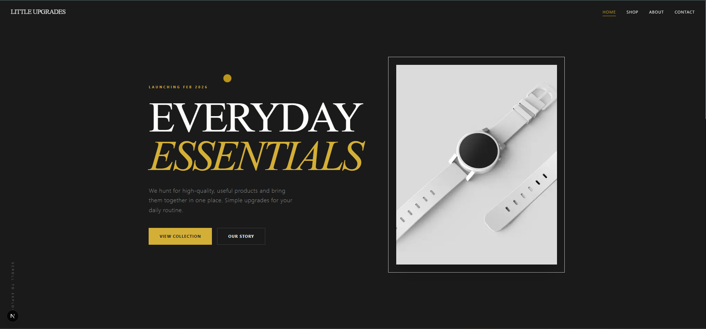

# **🏺 Little Upgrades**

**Everyday Essentials. Vetted. Simplified.**

Little Upgrades is a curated Amazon-based storefront dedicated to the "hunting" of high-quality, useful products across all categories. Founded in March 2026 by three software engineers with an eye for tangible design, the platform bridges the gap between digital precision and physical goods.

---

---

## **🛠 The Tech Stack**

This project was built to be fast, minimalist, and visually tactile:

* **Framework:** [Next.js 15](https://nextjs.org/) (App Router)  
* **Fonts:** [Geist Sans & Mono](https://vercel.com/font) (Vercel) \+ [Instrument Serif](https://fonts.google.com/specimen/Instrument+Serif)  
* **Styling:** [Tailwind CSS v4](https://tailwindcss.com/)  
* **Animations:** [Framer Motion](https://www.framer.com/motion/)  
* **Smooth Scroll:** [Lenis](https://lenis.darkroom.engineering/)  
* **Icons:** [Lucide React](https://lucide.dev/)  
* **Deployment:** [Vercel](https://vercel.com/)

## **✨ Key Features**

* **Custom Cursor Interface:** A custom-built, spring-physics cursor that reacts to interactive elements.  
* **Momentum Scrolling:** Integrated Lenis smooth-scroll for a premium, high-end feel.  
* **Geist Typography:** Utilizing Vercel's Geist typeface for a clean, developer-centric aesthetic.  
* **Optimized Performance:** Uses next/image for automated AVIF conversion and lazy loading of product shots.  
* **Responsive Layout:** A mobile-first approach designed for the modern shopper.  
* **Theme-Driven UI:** A sophisticated palette using \#D4AF37 (Amber), \#8C8C8C (Stone), and \#1A1A1A (Charcoal).

## **🚀 Deployment**

The site is currently deployed on **Vercel** and connected to a custom **Namecheap** domain.

### **Local Development**

1. **Clone the repository:**  
   git clone \[https://github.com/asimdaud/little-upgrades.git\](https://github.com/asimdaud/little-upgrades.git)

2. **Install dependencies:**  
   npm install

3. **Set up Environment Variables:**  
   Create a .env.local and add your EmailJS keys:  
   NEXT\_PUBLIC\_EMAILJS\_SERVICE\_ID=your\_id  
   NEXT\_PUBLIC\_EMAILJS\_TEMPLATE\_ID=your\_id  
   NEXT\_PUBLIC\_EMAILJS\_PUBLIC\_KEY=your\_key

4. **Run the development server:**  
   npm run dev

## **🗺 Roadmap**

* \[x\] Initial Next.js Migration  
* \[x\] Integration of Lenis Smooth Scroll  
* \[x\] SEO Optimization & Meta Tags  
* \[ \] Product Expansion (Tech & Tools / Home Goods)  
* \[ \] Direct Amazon Associate API Integration  
* \[ \] Newsletter Launch

## **✉️ Contact**

Little Upgrades is a family-run business based in the UK.

**Email:** [info@littleupgrades.co.uk](mailto:info@littleupgrades.co.uk)

**Web:** [littleupgrades.co.uk](https://littleupgrades.co.uk)

© 2026 Little Upgrades Ltd. All rights reserved.